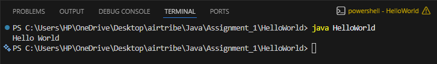

JDK Version Used :
Distribution: OpenJDK (Temurin)
Version: 21.0.10 LTS
Build: Temurin-21.0.10+7
VM: OpenJDK 64-Bit Server VM (mixed mode, sharing)

Verified Using :

1. java -version
   openjdk version "21.0.10" 2026-01-20 LTS
   OpenJDK Runtime Environment Temurin-21.0.10+7 (build 21.0.10+7-LTS)
   OpenJDK 64-Bit Server VM Temurin-21.0.10+7 (build 21.0.10+7-LTS, mixed mode, sharing)

2. javac -version:javac 21.0.10

How to install Java :

1. Go to https://adoptium.net
2. Download Temurin 21 (LTS) for your operating system.
3. Run the installer and follow the steps
4. Verify the installation by opening a terminal and running:
   java -version and javac -version

IDE Used : Visual Studio Code(VS Code)
Extensions installed: Extension Pack for Java

Hello World Program

1. Create a Java File named HelloWorld.java with the following content

public class HelloWorld {
public static void main(String[] args) {
System.out.println("Hello World");
}
}

2. Compile : Open a terminal in the same folder as the file exists and run : javac HelloWorld.java
   This creates a class file with byte code that helps to run this code in any platform HelloWorld.class

3. Run : java HelloWorld

OUTPUT : Hello World

The program compiled and ran successfully using OpenJDK 21.0.10 on VS Code terminal.
